# Batman's Kitchen CTF - Free Ram
Writeup by wumeno, March 2nd, 2026.

Everybody loves free ram right? Well unfortunately for our guy, he tried to download a free ram program (which don't exist btw), and got hit with a trojan!

This challenge came with a (not malicious) ransomware decryption program, and the poor guy's encrypted files.

## The program
We have here a program, opening it up, we are given a prompt for a key to reverse the encryption. We are then given another prompt for a directory, presumably for the program to decrypt the entire directory recursively.

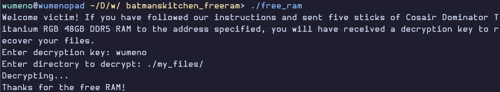

Looking at the resulting files, because we used the wrong key, our files are still unintelligible. In these files, we see an executable called "supertough", which I presume to be the poor guy's rev challenge.

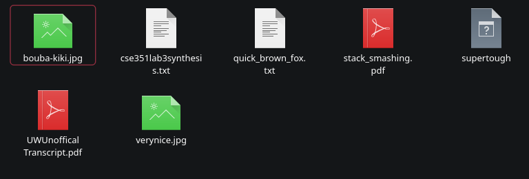

## Whats inside?
Using the ever so glorious Binary Ninja (not sponsored, but the CTF is sponsored by Vector 35), we can start peeking around. Through the program's powerful 'High Level Intermediate Language' representation, we get a version of the program's Pseudo C with more readable code due to the casting code being changed.

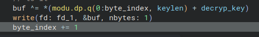
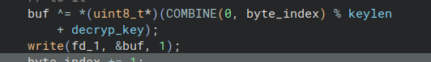

First, the key is first prompted for, and strangely enough, not modified or stored in this program. It is instead used in a different function


The program then asks for the directory to be decrypted. It then checks if the program (or the user running the program) has permissions to read the folder (using the stat syscall), alongside the folder's existence. Because of the nature of decompilation, I presume that the "perms" variable is a part of "var_14a8", which I believe to be a stat struct that was not seen by the decompiler. Unfortunately due to the nature of decompilation, they don't really see structs, which leads to some guesswork on variables in a program when they are using structs.

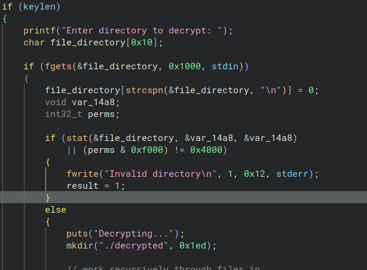

Now the most relevant part of this main function. The nftw function recursively goes through a folder, starting at the given folder, executing a function on any files it comes across. The function mentioned here is what i've labelled as the "decryption_func", which I have renamed using Binary Ninja. Luckily, Binary Ninja keeps the comments and renaming I have written in a separate file to the binary. This function is actually an extension of another function called `ftw()`, which stands for file tree walk, with the difference in `nftw()` being the usage of flags, none of which are used in the function.

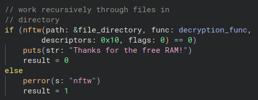

## The decryption function
This is what I presume to be the most important part of the challenge, as it allows us to decrypt the files ourselves. This decryption function needs to use a predetermined function signature of `int fn(const char *, const struct stat *, int, struct FTW *)`, which I presume filepath, arg2, and arg3 are. The function does not seem to use args 2 and 3 in any notable way, however.

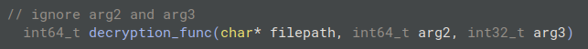

After opening the file, the program checks for the magic number, in which the first byte is 0x67, what a bunch of children. It then finds the file's actual name (different) by finding the last occurence of the `/` character, and assigning a new variable i've dubbed 'filename' (thanks to Binary Ninja's renaming function) pointing to where the last `/` character is. This file name is then used to create a file in the "decrypted" folder with the same file name.

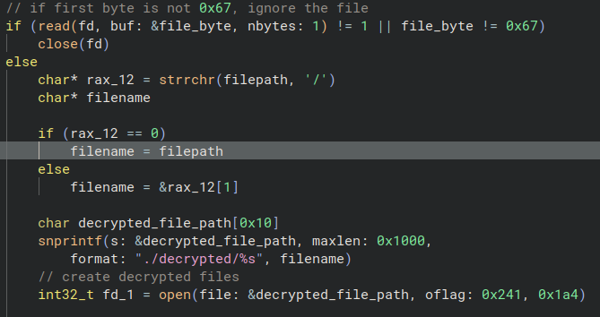

Now for the real meat of the challenge. The function reads a byte from the encrypted file, runs a function named `rotate_byte_right()` on the byte, then the byte is xored by a strange set of instructions that I did not initially understand, due to the limitations of Pseudo C and High Level IL.

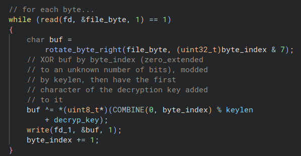

Now, two things you may have noticed. Number one, I have spoiled my own writeup because of the comments I left in here around the code. The great Binary Ninja allows you to comment around a file's assembly or decompiled code, allowing for detailed explanations of already reverse engineered parts. Second, the byte enumeration asks the `rotate_byte_right()` function to shift the byte by the number given by the index's least significant 3 bytes. I would believe that this is equivalent to performing `% 8` on the byte index. 

Any way, the rotate by right function takes two clones of the byte, one where its shifted right by the given shift amount, and another where it is shifted left by 8 minus the shift amount. These two bytes are then OR'd on each other, and the result is returned as a byte. This is the program's first step of obfuscation.

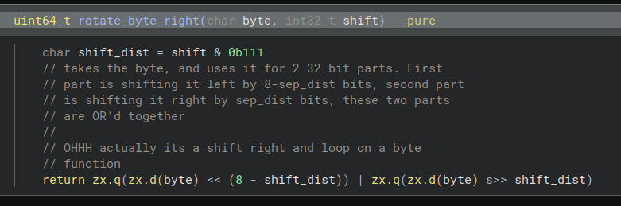

This second part of obfuscation is much trickier to understand when using the high level IL/Pseudo C. Fortunately Binary Ninja can display the file in assembly, and it comes with a built in debugger ready with breakpoints.

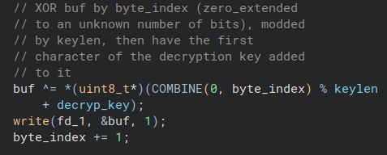

To help me understand the disassembly better, Binary Ninja's debugger has a register display and a stack display, so I could understand how the program got to the given result. Any way, this code first gets the pointer to the decryption key, which was not used until now. It then gets the key length and the current index of the byte in the read file. Using the div operator, the byte index (rax) is divided by the key length (rsi), the remainder of this operation ends up in register rdx, the value of which is transferred to rsi. The remainder is then added to the decryption key pointer, giving an offset referring to the character in the key. This offset is then dereferenced, giving us the byte used to XOR the rotated byte from the file.

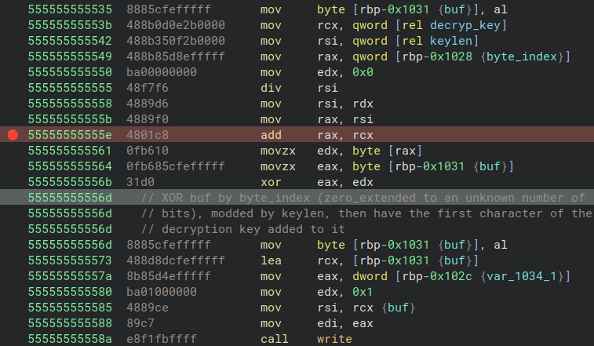

So, turns out the key we input is used to XOR the rotated bytes. To crack this ransomware, we need the key.

## How to get the key
The given cryptosystem is related to XOR, which means if we want the key, we can reverse it from the ciphertext and known plaintext. However, we do need a known plaintext.

Searching the given files, we find one interesting file. The name is straightforward and obvious, its the famous sentence with all English characters! "the quick brown fox jumped over the lazy dog".

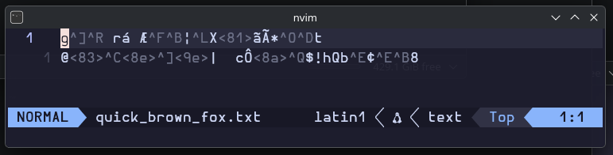

Assuming that this file has this exact content, we can use a python program to reverse the key. First, we rotate the plaintext the same way the program does, we then read the `quick_brown_fox.txt` file and xor its contents with the rotated plaintext.

```python
from Crypto.Util.strxor import strxor
def rotate_byte_right(byte: int, shift: int) -> int:
    new = byte % 256
    return (new << (8-shift)) | (new >> shift) % 256

file = b"my_files/school_stuff/quick_brown_fox.txt"
expected = b"the quick brown fox jumps over the lazy dog"

if __name__ == "__main__":
    ori_string = b""
    with open(file, "rb") as item:
        ori_string = item.read()[1:]

    rotated = b""
    for ind, i in enumerate(ori_string):
        newchr = rotate_byte_right(i, ind % 8) % 256
        rotated += bytes(chr(newchr), "latin-1")

    print(len(expected), len(rotated))
    possiblekey = strxor(expected, rotated)
    for i in possiblekey[:100]:
        #print(f"{i:02x}", end=" ")
        print(chr(i), end = "")
```

Running this, we get the following output.

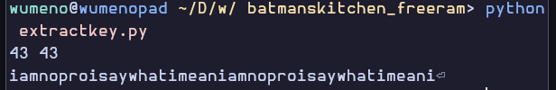

Obviously, because of the nature of the XOR part of `decryption_func()`, the key repeats multiple times. Its obvious that the key is 'iamnoproisaywhatimean'

## Supertough
Now inputting the given key, we now get the recovered contents of the poor guy's folder, including their supertough rev challenge. Lets open it in Binary Ninja aaaaanddd...

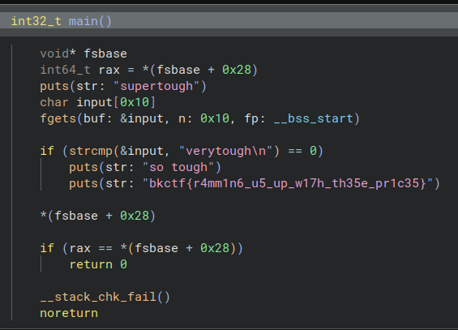

Yep, yep, yeah. I have to admit, that was not tough at all.

The flag is directly in the binary, wow. It is `bkctf{r4mm1n6_u5_up_w17h_th35e_pr1c35}`

## In conclusion...
This challenge was quite fun and challenging, with some unique parts, a nice amount of XOR usage, and some great humour. Shout out to Laptic, the challenge's creator, and Vector 35 for Binary Ninja, the decompiler and debugger that carried me throughout this challenge and into BKCTF (please give me a Binary Ninja licence, I did this challenge entirely on the free version). I hope that this poor guy learns to not download RAM from the internet, and that RAM prices go down.

Love and peace from wumeno.


